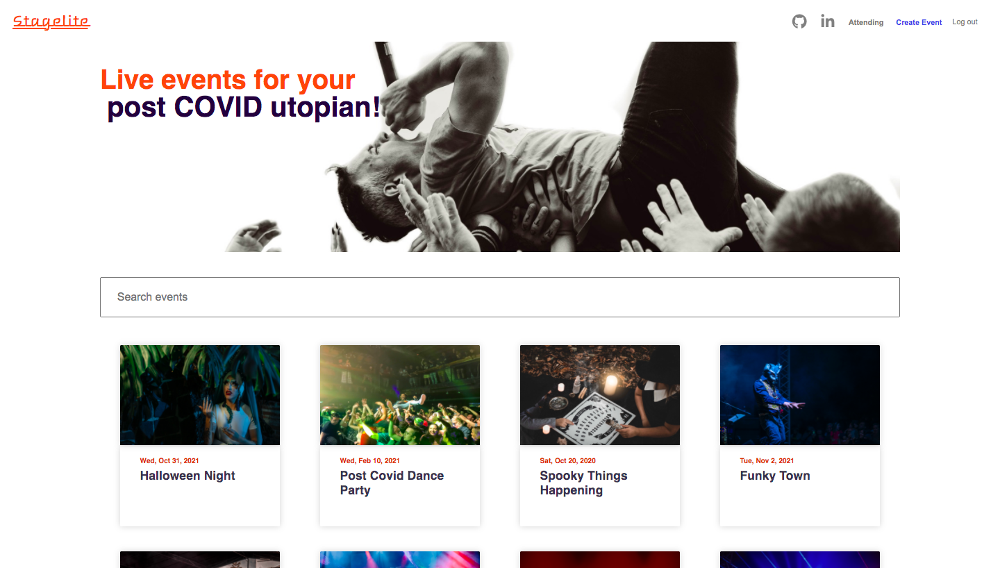

# Stagelite
###### [Live Site](https://stagelite.herokuapp.com/#/)

)

## Table of Contents

  * [Background](#background)
  * [Technologies](#technologies)
  * [Features](#features)
    * [User Auth](#user-auth)
    * [Events](#events)
  * [Dynamic Nav-bar](#dynamic-nav-bar)
  
## Background

Stagelite is a full stack web application inspired by the website Eventbrite. The website allows users to create an account and sign in. When logged in the users can create, edit and buy tickets to events. If a user does not want to sign up for an account, they can use the demo login or still explore the events index and events show pages. 

This site was built on a Ruby on Rails framework for the backend with active record. PostgreSQL was used as the database to store the data along with Amazon AWS S3, which was used to store images for the events. React and Redux were utilized to create a dynamic, single-page web app allowing users to smoothly navigate through the site. 

## Technologies
* Ruby on Rails
* React.js
* Redux.js
* Node.js
* PostgreSQL
* Webpack
* Amazon AWS S3
* Google Maps Javascript API

## Features
* Create events
* Edit events
* Manage events created
* Browse events by genre
* Get tickets for an event

### User Auth 

* Users can sign up and sign in on stagelite, and login to view their events.
* Users who do not want to create an account are able to login as a demo user to navigate throughout the website and use it's features
* Once logged in the nav bar changes and the user is redirected to the profile page.

### Events

* Users can create, edit and manage their events.
* Createres can search events by genre and once logged in the user can buy tickets to other users events.

### Dynamic Nav-bar
  * The nav bar changes depending on if a user a logged in or not.
  * The nav-bar is located in a seperate component to keep the code clean and organized. 
---